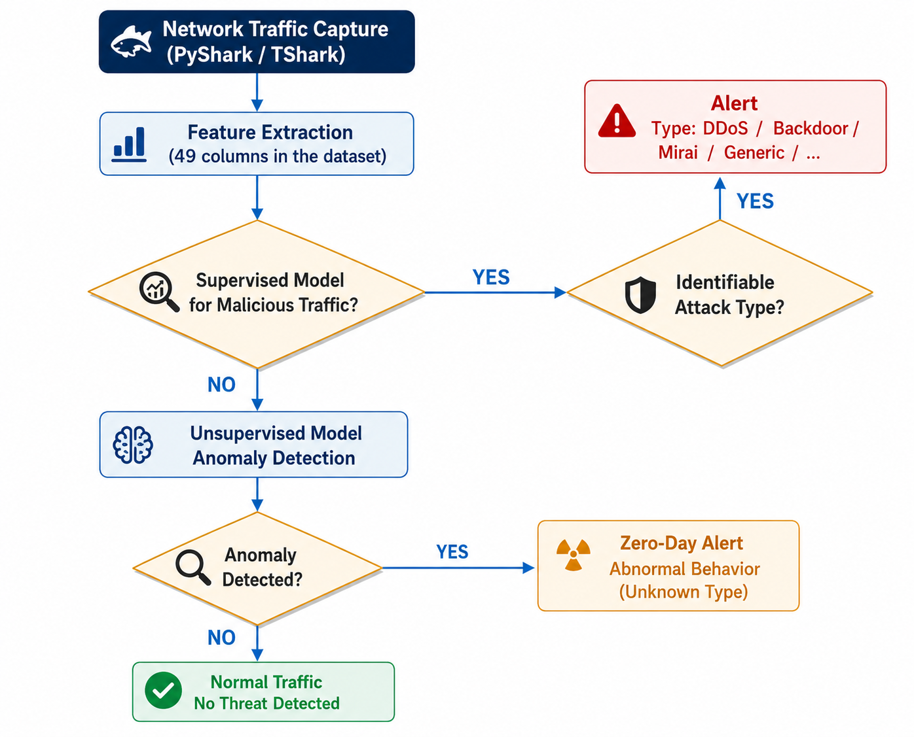
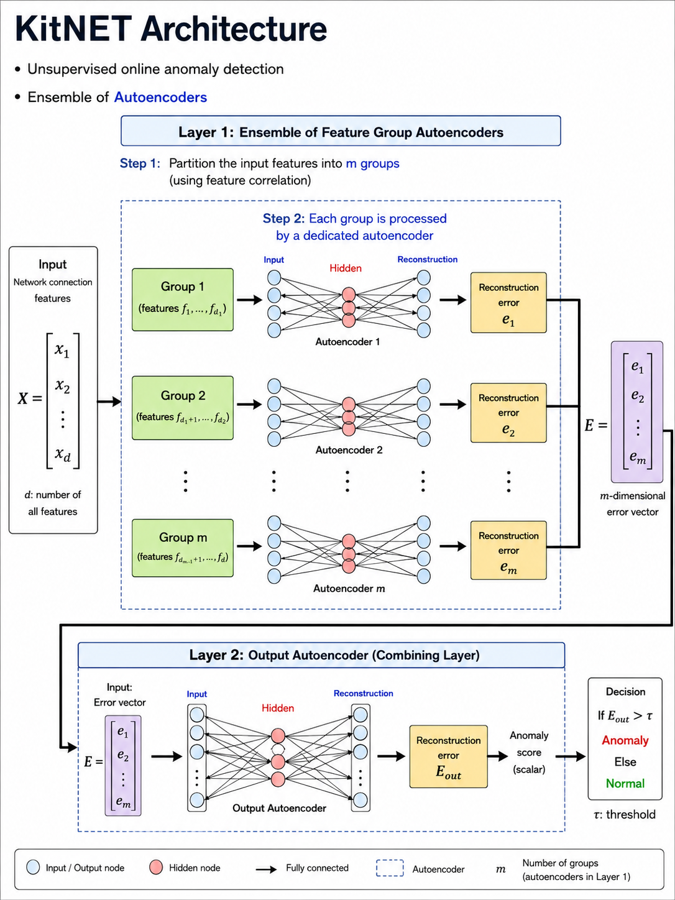

# 🛡️ NetGuard — Real-Time Network Intrusion Detection System

> Hybrid AI platform combining **Supervised XGBoost** + **Unsupervised KitNET** for real-time IoT threat detection.
> Built on the UNSW-NB15 and Kitsune/Mirai datasets · Flask REST API · Single-page dashboard

---

##  Interface Overview


<video src="https://github.com/NesrineTaamallah/nids/issues/1#issue-4519066181" controls width="100%"></video>

##  Architecture

NetGuard uses a **sequential dual-pipeline** decision architecture:




---

# ML Pipelines


## Pipeline A — Supervised (UNSW-NB15 · 2,540,044 flows)

###  Key Results

| Model | Task | F1 Score | AUC |
|---|---|---|---|
| Random Forest | Binary (Normal vs Attack) | **0.979** | **1.000** |
| XGBoost | Multi-class (9 attack types) | — | — |
| **Hierarchical Pipeline** | Binary + Multi-class | **Best macro F1** | — |


###  Pipeline

**Features:** 70 engineered features from 49 raw UNSW-NB15 columns

#### Preprocessing

| Step | Strategy |
|---|---|
| Missing values | Context-aware imputation per column type |
| High-cardinality categoricals | Frequency encoding (`proto`, `sport`, `dsport`) |
| Nominal categoricals | One-Hot Encoding (`state` × 16, `service` × 13) |
| Skewed features (31/35) | `log1p` + Yeo-Johnson power transform |
| Normalization | `StandardScaler` (fit on train only) |
| Class imbalance | `class_weight='balanced'` (RF), SMOTE for rare classes |

#### Architecture

**Stage 1 — Binary Filter:** Random Forest, 200 estimators, 5-fold stratified CV

**Stage 2 — Multi-class:** XGBoost, 500 estimators, `lr=0.05`, `max_depth=6`, early stopping


---

## Pipeline B — Unsupervised / Zero-Day (Mirai · 764,137 packets)

###  Key Results

- Trained exclusively on **70,000 benign packets**; detects **694,000 Mirai attack packets** with no labeled examples
- Detection threshold: `φ = exp(μ_ln + 3σ_ln)` — guarantees **99.7% normal traffic coverage** (3σ rule)
- Fixed pre-computed threshold: `φ = 0.046556`

###  Pipeline

#### AfterImage — Temporal Feature Extraction

115 features per packet across **5 channels × 5 time windows** (λ ∈ {5, 3, 1, 0.1, 0.01}):

| Channel | Captures |
|---|---|
| Source IP | Volume/rate of outgoing traffic |
| Destination IP | Traffic targeting a host |
| IP↔IP pair | Bidirectional flow between two IPs |
| IP↔Port | Service-specific traffic patterns |
| Full socket | Complete TCP/UDP flow fingerprint |

#### KitNET Architecture

KitNET is an **online ensemble of autoencoders** — no memory storage, processes one packet at a time. Each subgroup of correlated features has a dedicated autoencoder; the final RMSE score feeds an output autoencoder.




##  Project Structure

```
netguard/
├── app.py                             # Flask backend (API + capture + inference)
├── index.html                         # Single-page dashboard (no build step)
├── requirements.txt
├── models/
│   ├── best_binary_model.pkl          # Random Forest binary classifier
│   ├── scaler_binary.pkl
│   ├── powertransformer_binary.pkl    # Optional Yeo-Johnson
│   ├── xgb_hierarchical_multiclass.pkl
│   ├── scaler_hierarchical.pkl
│   ├── label_encoder_hierarchical.pkl
│   ├── kitsune_mirai_model.pkl        # Pre-trained KitNET (Mirai dataset)
│   └── metadata.json                  # Feature names, attack classes
└── KitNET-py/                         # Clone separately (see Setup)
```

---

##  Installation

**Prerequisites:** Python 3.8+, TShark/Wireshark (for live capture), Git

```bash
# 1. Clone the repo
git clone https://github.com/<your-org>/netguard.git && cd netguard

# 2. Install Python dependencies
pip install -r requirements.txt

# 3. Clone KitNET library (must be placed next to app.py)
git clone https://github.com/ymirsky/KitNET-py.git

# 4. Place trained model .pkl files + metadata.json inside models/

# 5. Start the backend
python app.py
# → http://0.0.0.0:5050

# 6. Open index.html in your browser (or navigate to http://localhost:5050)
```

> ⚠️ Without model `.pkl` files the system runs in **stub mode** — heuristic mock predictions, useful for UI testing.

---

##  Usage

### Live Capture Mode
1. Select a network interface (or **Simulation Mode** for synthetic traffic)
2. Click **▶ Start Capture**
3. Flows appear in real-time — color-coded green (Normal), red (Attack), yellow (Zero-Day)
4. KitNET warm-up bar shows calibration progress (500 packets) then switches to live RMSE scoring


### CSV Import Mode
1. Switch to **📂 CSV** tab
2. Upload any UNSW-NB15-formatted CSV file
3. Click **🔍 Analyze CSV** — results include label, category, confidence, and KitNET RMSE per row


---


## 🎬 Demo Guide & Recommended Tools

### Option 1 — Simulation Mode (no setup needed)
Select **Simulation Mode** in the interface dropdown. The backend generates synthetic flows across 10 realistic scenarios (HTTP, DNS, SSH, DoS, Reconnaissance, Backdoor…) — no TShark or network permissions required. Best for demos on any laptop.

### Option 2 — Live Traffic on a Real Interface
Requires TShark installed and running with admin/root privileges:
```bash
# Linux
sudo python app.py

# Windows — run terminal as Administrator
python app.py
```

### Option 3 — CSV Replay (reproducible demo)
Download a subset of UNSW-NB15 from [Kaggle](https://www.kaggle.com/datasets/mrwellsdavid/unsw-nb15) and upload it in CSV mode. Gives a controlled, reproducible demo with known ground truth.


---

## 🧪 Dataset Summary

| Dataset | Flows/Packets | Use | Source |
|---|---|---|---|
| UNSW-NB15 | 2,540,044 flows | Supervised training | UNSW Canberra |
| Kitsune/Mirai | 764,137 packets | KitNET training | UCI ML Repo #516 |


---

## 📚 References

1. Moustafa & Slay — *UNSW-NB15*, MilCIS 2015
2. Mirsky et al. — *Kitsune: Ensemble of Autoencoders for NIDS*, NDSS 2018
3. Antonakakis et al. — *Understanding the Mirai Botnet*, USENIX Security 2017
4. Chawla et al. — *SMOTE*, JAIR 2002
5. IBM Security — *Cost of a Data Breach Report 2024*

---

<div align="center">
<b>NetGuard</b> · Real-Time IoT Malware Detection · EPT 2024–2025
</div>
